<!DOCTYPE html>
<html lang="ro">
<head>
    <meta charset="UTF-8">
    <title>Anida rețete – Prăjitură ora XII</title>
    <meta name="viewport" content="width=device-width, initial-scale=1.0">
    <link rel="stylesheet" href="style.css">
</head>
<body>

    <!-- CHENAR PRINCIPAL -->
    

<h1>Bine ai venit!</h1>
<h2 class="subtitle">Anida rețete</h2>

        <!-- POZA PRINCIPALĂ -->
        

        

        <h1>Prăjitură ora XII</h1>

        <h2>Ingrediente blat :</h2>
        <ul>
            <li>7 ouă</li>
            <li>7 linguri de zahăr (aprox.170 g)</li>
            <li>7 linguri de faină (aprox.180 g)</li>
            <li>4 linguri cacao (aprox.50 g)</li>
            <li>50 ml ulei</li>
            <li>50 ml apă</li>
            <li>1 plic praf de copt</li>
            <li>esenţă de vanilie</li>
        </ul>

        <h2>Ingrediente sirop :</h2>
        <ul>
            <li>700 ml apă</li>
            <li>280 g zahăr</li>
            <li>2 plicuri zahăr vanilat</li>
        </ul>

        <h2>Ingrediente glazură :</h2>
        <ul>
            <li>200 ml frișcă lichidă</li>
            <li>200 g ciocolata neagră</li>
        </ul>

        <h2>Ptr.ornat :</h2>
        <ul>
            <li>200 ml frișcă lichidă</li>
        </ul>

        <h2>Mod de preparare:</h2>

        <!-- Pași individuali, imagine deasupra textului -->
        

            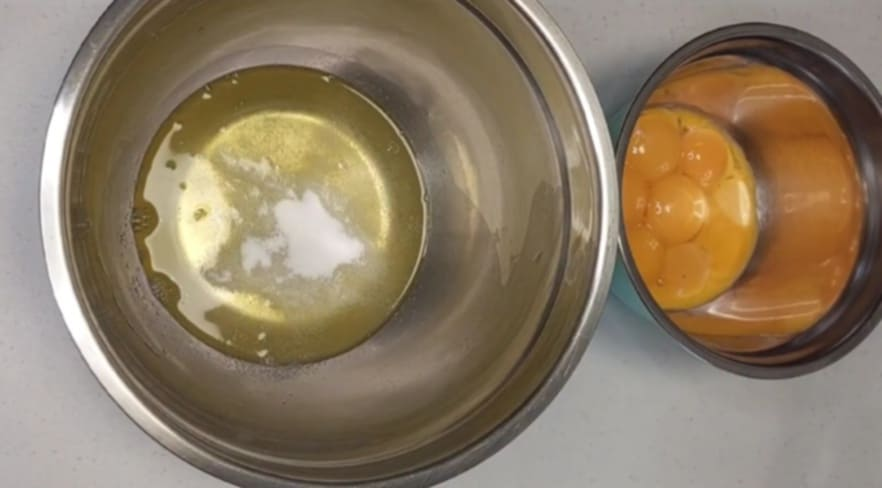
            
Separăm albușurile de gălbenuşuri.

        

        

            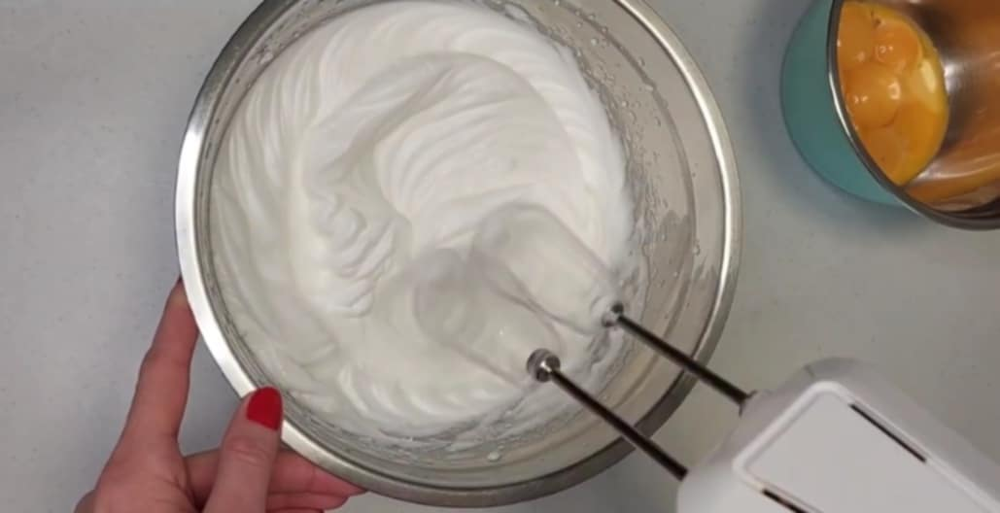
            
Peste albușuri adaugam zahărul, zahărul vanilat, sare și le batem spumă.

        

        

            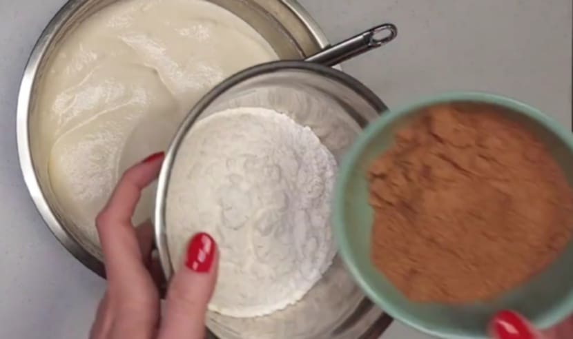
            
Când am terminat punem bolul deoparte.

        

        

            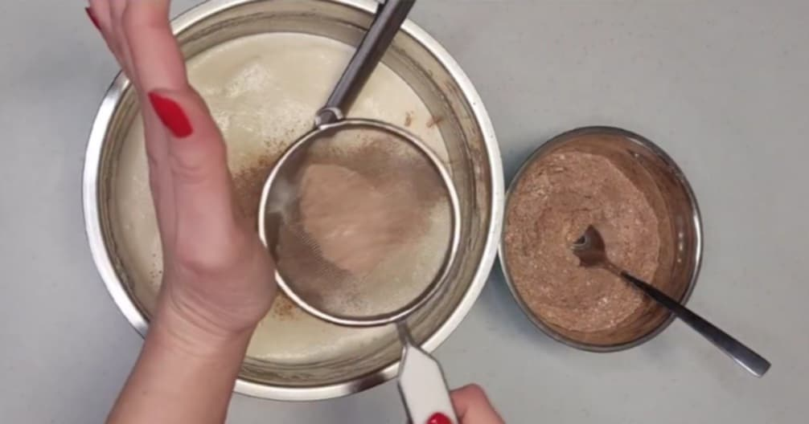
            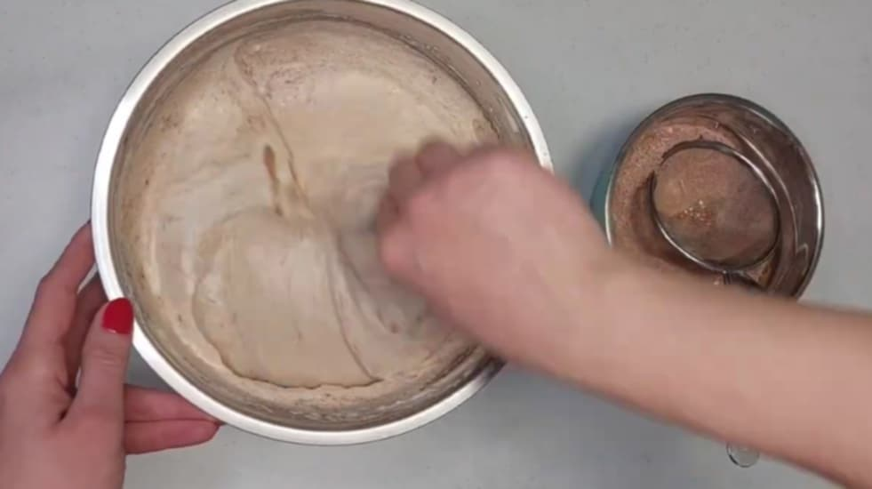
            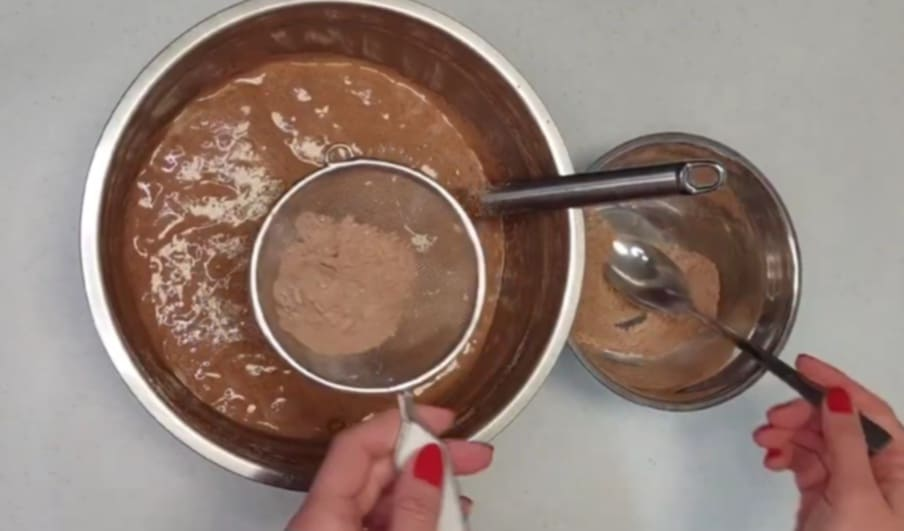
            
Amestecăm făina cu cacao și praful de copt, apoi cernem treptat în compoziție și amestecăm.

        

        

            
            
Punem aluatul în tava unsă cu ulei și nivelăm.

        

        

            
            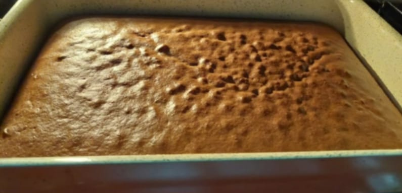
            
Introducem tava la cuptor la 180°C pentru 25-30 min.

        

        

            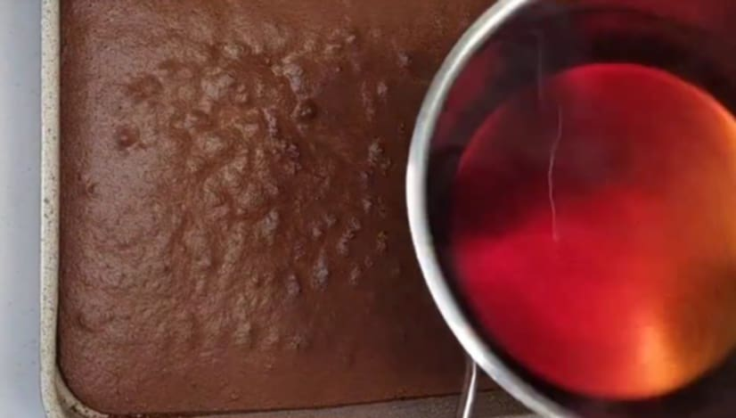
            
Turnăm siropul peste blat și lăsăm să se absoarbă.

        

        

            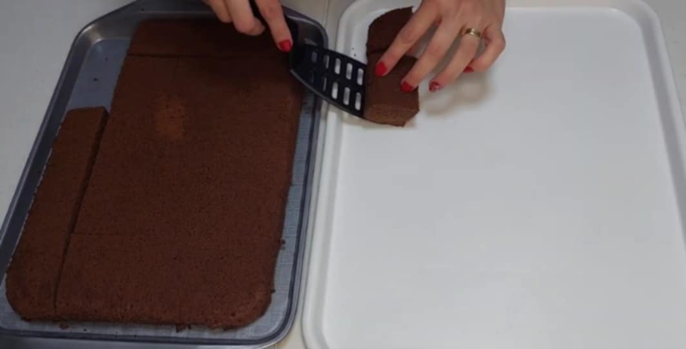
            
Tăiem blatul în pătrate (mi-au ieșit 20 bucăți).

        

        

            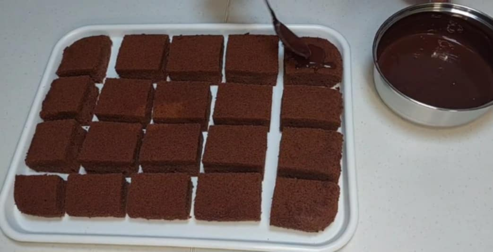
            
Punem ciocolată peste fiecare bucată.

        

        

            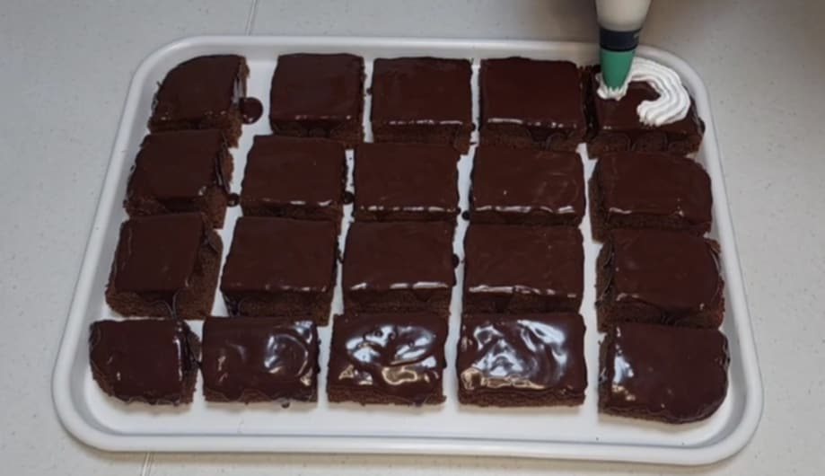
            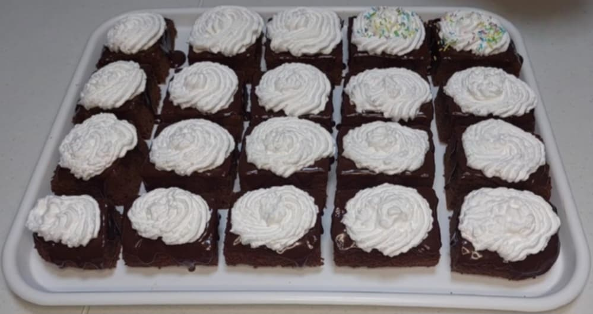
            
Decorăm cu frișcă și bomboane colorate.

        

        

            
            
<strong>Poftă bună!</strong>

      <!-- LINK YOUTUBE -->
        

            <a href="https://youtu.be/IiS2pwvLYZc?si=zKAIDN3HtgzGAFoC" target="_blank">
                ▶ Vezi rețeta video pe YouTube
            </a>      
        

    
 <!-- end card -->

 <!-- end container -->

</body>
</html>

body {
    margin: 0;
    font-family: 'Georgia', serif;
    font-size: 18px;
    background-color: #fff7ed;
    color: #374151;
    display: flex;
    justify-content: center;
}

.container {
    width: 100%;
    max-width: 500px;
    padding: 10px;
}

/* CHENAR PRINCIPAL */
.card {
    background: transparent;
    padding: 15px;
    border-radius: 16px;
    box-shadow: 0 10px 25px rgba(0,0,0,0.1);
    text-align: 0 px ;
}

/* POZA PRINCIPALĂ */
.poza-sus {
    width: 50%; /* mai mică */
    max-width: 500px;
    margin: auto;
    display: auto;
    border-radius: 12px;
}

/* LINK YOUTUBE */
.youtube-link {
    margin:15px 0 25px ;
}

.youtube-link a {
    background: linear-gradient(90deg, #f87171, #dc2626);
    color: white;
    padding: 12px 18px;
    border-radius: 10px;
    font-weight: bold;
    text-decoration: none;
    transition: 0.3s;
}

.youtube-link a:hover {
    transform: scale(1.05);
    background: linear-gradient(90deg, #b91c1c, #7f1d1d);
}

/* TITLURI */
h1 {
    color: #b91c1c;
    font-size: 32px;
    margin-bottom: 15px;
}

h2 {
    color: #92400e;
    margin-top: 20px;
}

/* LISTE */
ul {
    list-style: none;
    padding-left: 0;
    text-align: auto;
}

ul li {
    margin-bottom: 6px;
}

/* PAȘI VERTICALI (mobil) */
.pas-vertical {
    display: auto;
    flex-direction: column;
    align-items: auto;
    margin-bottom: 20px;
}

.pas-vertical img {
    width: 80%;
    max-width: 250px;
    border-radius: 12px;
    margin-bottom: 10px;
}

.pas-vertical p {
    margin: 0;
    line-height: 1.5;
}

/* PAȘI MULTIPLE (scrollable pe mobil) */
.pas-vertical-multiple {
    display: auto;
    flex-direction: column;
    align-items: center;
    margin-bottom: 20px;
}

.pas-vertical-multiple img {
    width: 80%;
    max-width: 500px;
    border-radius: 12px;
    margin-bottom: 5px;
}

.pas-vertical-multiple p {
    margin: 0;
    line-height: 1.5;
}

/* MEDIA QUERY pentru desktop */
@media(min-width: 768px){
    .pas-vertical {
        flex-direction: row;
        align-items: flex-start;
        gap: 15px;
        justify-content: center;
    }

    .pas-vertical img, .pas-vertical-multiple img {
        width: 150px;
        height: 150px;
        margin-bottom: 0;
    }

    .pas-vertical p, .pas-vertical-multiple p {
        max-width: 500px;
        text-align: left;
    }

    .pas-vertical-multiple {
        flex-direction: row;
        gap: 10px;
    }
}

